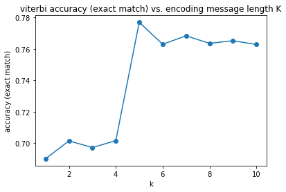
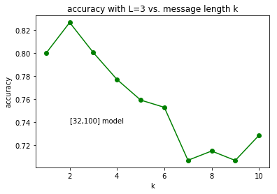
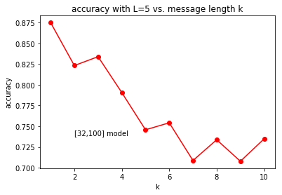
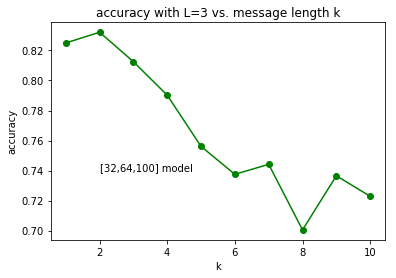
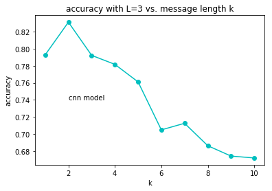
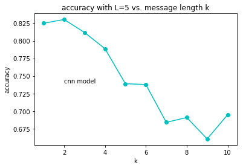

# Results

This report corresponds to [v2-2.0 notebook](https://github.com/Michael-Tu/radioML/blob/master/notebooks/ecc-v2-v2.0.ipynb)

**Viterbi Decoding Accuracy**




**FNN (32-100) Accuracy vs. Message Length K**

Constraint Length of 3




Constraint Length of 5




**FNN (32-64-100) Accuracy vs. Message Length K**

Constraint Length of 3




Constraint Length of 5


**CNN Accuracy vs. Message Length K**

Constraint Length of 3



Constraint Length of 5




# Example Results

Below are some results for the `[32,100]-fnn-model-l3` model with 76.4% test accuracy

```
Expected:  [0, 0, 1, 1, 0]
Deocde:    [0, 0, 1, 1, 0]

Expected:  [1, 1, 0, 1, 1]
Deocde:    [1, 1, 0, 0, 1]

Expected:  [1, 0, 1, 1, 1]
Deocde:    [0, 0, 0, 1, 1]

Expected:  [0, 1, 1, 0, 0]
Deocde:    [0, 0, 0, 0, 0]

Expected:  [0, 0, 0, 0, 0]
Deocde:    [0, 0, 1, 1, 0]
```


Below are some results for the `k5-l3-cnn-v2.h5` CNN model with 76.35% test accuracy

```

Expected:  [1, 0, 1, 0, 1]
Deocde:    [1, 0, 1, 0, 1]


Expected:  [0, 0, 0, 0, 0]
Deocde:    [0, 0, 0, 0, 0]

Expected:  [0, 0, 0, 1, 0]
Deocde:    [0, 0, 0, 1, 0]

Expected:  [0, 1, 1, 1, 1]
Deocde:    [0, 1, 1, 1, 1]

Expected:  [0, 1, 1, 1, 1]
Deocde:    [1, 1, 1, 1, 1]

Expected:  [0, 0, 0, 0, 1]
Deocde:    [1, 0, 0, 0, 1]

Expected:  [1, 1, 1, 0, 1]
Deocde:    [1, 1, 1, 0, 1]

Expected:  [0, 0, 0, 0, 0]
Deocde:    [1, 1, 0, 0, 0]

```


# FNN Architectures Search Space:

```
FNN_ARCHITECTURE = [
    [32, 100],
    [64, 100],
    [128, 100],
    [256, 100],
    [32, 32, 100],
    [32, 64, 100],
    [64, 64, 100],
    [64, 128, 100],
    [128, 128, 100],
    [128, 256, 100],
    [256, 256, 100],
    [32,128,128,100],
    [32,128,256,100],
    [32,256,256,100],
    [32,128,256,128,100],
    [32,128,128,128,100],
    [1024,512,100],
    [512,256,100],
    [256,128,100],
    [128,100,100]
]
```


## Hyperparameters

```
BATCH_SIZE = 64
EPOCHS = 50
ACTIVATION = "relu"
l2_reg_strength = 0.001
LR = 0.015
optimizer = "adam"
```
 
# CNN Architecture

```
Conv1D(filters=16, kernel_size=3, strides=1, padding="same", activation="relu")

Conv1D(filters=16, kernel_size=3, strides=1, padding="same", activation="relu")

Conv1D(filters=16, kernel_size=3, strides=1, padding="same", activation="relu")

Conv1D(filters=16, kernel_size=3, strides=1, padding="same", activation="relu")

Flatten()

Dense(194, activation="relu")

Dropout(0.5)

Dense(200, activation="sigmoid")

Reshape(output=(100,2))
```

**Insight**: 

- without pooling operations seem to do better based on experiments
- Maxpooling is better than average pooling, performance wise
- CNN and FNN both overfit by predicting all of the same byte when k = 100, no matter what regularizations we use


