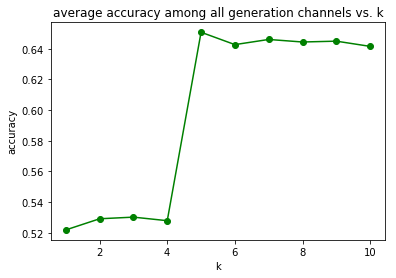
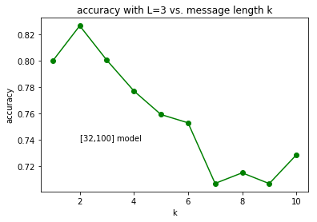
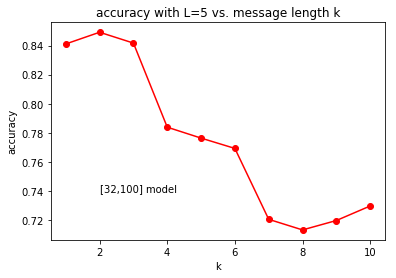
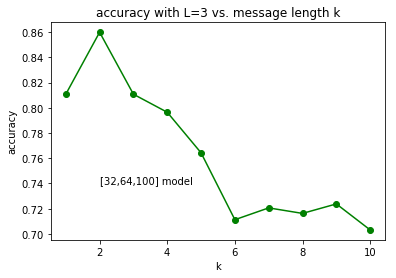
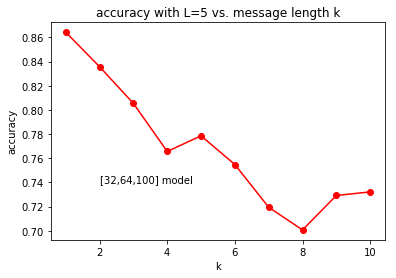

# Results

**Viterbi Decoding Accuracy**

**FNN (32-100) Accuracy vs. Message Length K**

Constraint Length of 3

Constraint Length of 5

**FNN (32-64-100) Accuracy vs. Message Length K**

Constraint Length of 3

Constraint Length of 5
