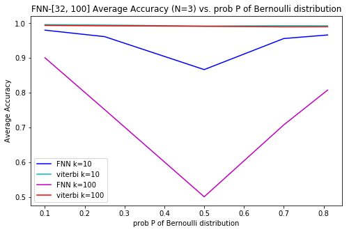
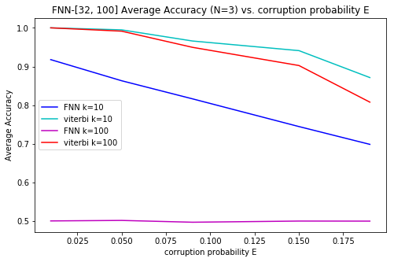
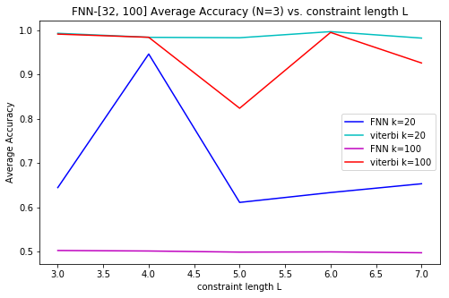

# Results

This report corresponds to [v3 notebook](https://github.com/Michael-Tu/radioML/blob/master/notebooks/ecc-v3.ipynb)

# Accuracy of FNN Model

Computed Over Different Variables (n=2000):

```
k = message length (k-bit)
p = probability of Bernoulli(p) in which the random k-bit sequence is drawn from
e = corruption probability
l = constraint length
```


**Variable `p = [0.1, 0.25, 0.5, 0.7, 0.81]`):**

Fixed: `n = 2000, error = 0.05, rate = 0.5, l = 3`




**Variable `error = [0.01, 0.05, 0.09, 0.15, 0.19]`):**

Fixed: `n = 2000, p = 0.5, l = 3`

Note, due to channel capacity: `rate = 0.5` for `0 < error < 0.1` and `rate = 1/3` for `0.1 <= error < 0.2`.



**Variable `l = [3, 4, 5, 6, 7]`:**

Fixed: `n = 2000, p = 0.05, error = 0.05, rate = 0.5`



**Variable `k = [1, ..., 20, 50, 100, 150, 200]`:**

Fixed: `n = 2000, p = 0.05, error = 0.05, rate = 0.5, l = 3`


