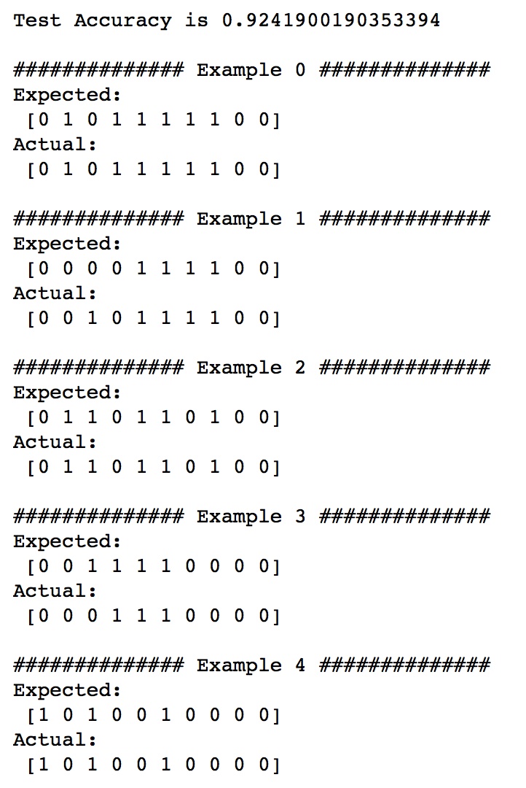
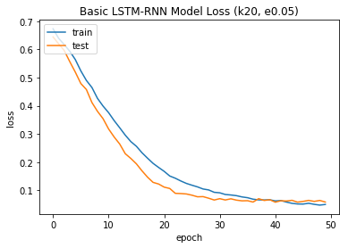

viterbi-k-acc

viterbi-k-logacc

lstm-rnn-k10&20&40-e0.05-train

lstm-rnn-k10&20&40-e0.05-train-2

lstm-rnn-k10&20-e0.15-train

lstm-rnn-k10-e0.05-train

lstm-rnn-k10-e0.05-result

lstm-rnn-k10-e0.15-train

lstm-rnn-k10-e0.15-result

lstm-rnn-k20-e0.05-train

lstm-rnn-k20-e0.05-result

lstm-rnn-k20-e0.15-train

lstm-rnn-k20-e0.15-result

lstm-rnn-k40-e0.05-train

lstm-rnn-k40-e0.05-train-2

lstm-rnn-k40-e0.05-result

lstm-rnn-k40-e0.05-result-2

