# Bidirectional LSTM-RNN vs. Basic LSTM-RNN Convergence Rate

Fixed: `n = 25000, rate = 0.5, p = 0.5, l = 3`

error = 0.05

**K10**

Basic LSTM

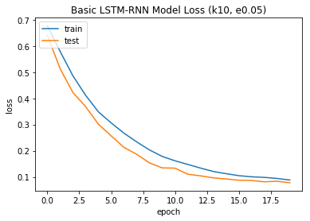

Bidirectional LSTM

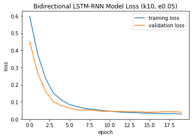

**K20**

Basic LSTM

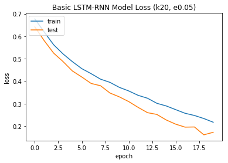

Bidirectional LSTM

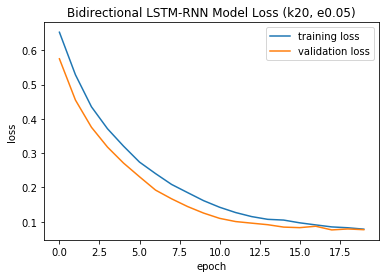

**K40**

Basic LSTM

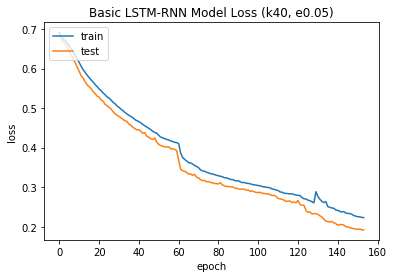

Bidirectional LSTM

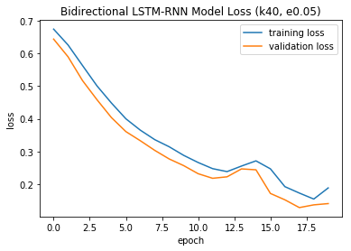

# Bidirectional LSTM-RNN on High Error Rate

Fixed: `n = 25000, rate = 0.5, p = 0.5, l = 3`

error = 0.15

**K10**

Basic LSTM

Bidirectional LSTM

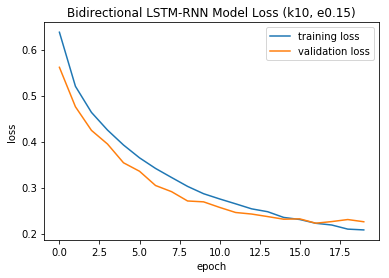

**K20**

Basic LSTM

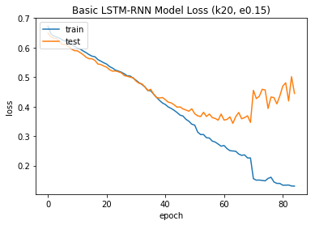

Bidirectional LSTM

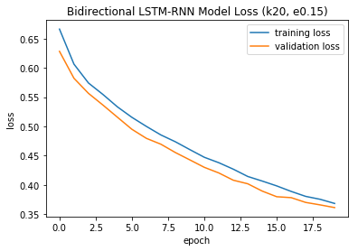

### Normalization of Training Data

basic-normalization-train

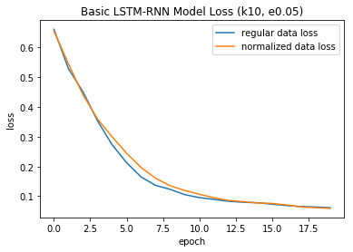

basic-normalization-val

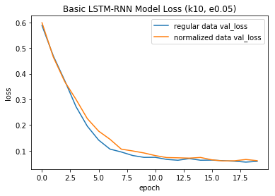